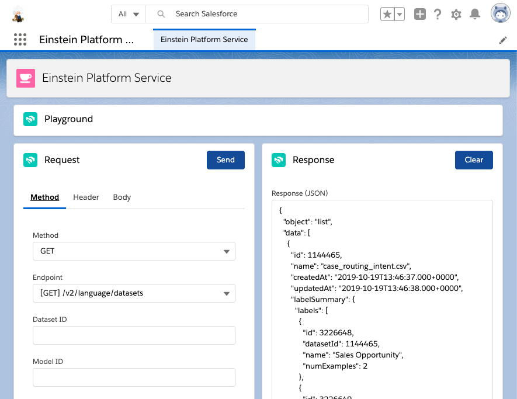

# Einstein Platform Services Basic

Einstein Platform Services Basic を基礎から学習していきましょう。

# Curriculum

- [事前準備](https://github.com/takahitomiyamoto/einstein-platform-services-basic/wiki/Prerequisite)
- [Einstein Language](https://github.com/takahitomiyamoto/einstein-platform-services-basic/wiki/Einstein-Language)
- [Einstein Vision](https://github.com/takahitomiyamoto/einstein-platform-services-basic/wiki/Einstein-Vision)

# Appendix

## Trailhead

- [人工知能の基本](https://trailhead.salesforce.com/ja/content/learn/modules/ai_basics)
- [ビジネスのための人工知能](https://trailhead.salesforce.com/ja/content/learn/modules/artificial-intelligence-for-business)
- [人工知能の責任ある作成](https://trailhead.salesforce.com/ja/content/learn/modules/responsible-creation-of-artificial-intelligence)
- [Salesforce Einstein の基礎](https://trailhead.salesforce.com/ja/content/learn/modules/get_smart_einstein_feat)
- [猫の品種を認識する Cat Rescue アプリケーションの構築](https://trailhead.salesforce.com/ja/content/learn/projects/build-a-cat-rescue-app-that-recognizes-cat-breeds)
- [Einstein Intent API の基礎](https://trailhead.salesforce.com/ja/content/learn/modules/einstein_intent_basics)
- [クイックスタート: Einstein Image Classification](https://trailhead.salesforce.com/ja/content/learn/projects/predictive_vision_apex)
- [Explore Deep Learning for Natural Language Processing](https://trailhead.salesforce.com/ja/content/learn/trails/explore-deep-learning-for-nlp)

## Developer Guide

- [Easily Build AI-Powered Apps](https://metamind.readme.io/)
- [Salesforce Einstein Hub](http://www.einstein-hub.com/)

## About me

- [Tech Blog](https://qiita.com/takahito0508)
- [Lifestyle Blog](https://medium.com/takahitomiyamoto)

## Landing Page

- [GitHub Page](https://takahitomiyamoto.github.io/einstein-platform-services-basic/)

  # Einstein Platform Service App



## install my app

```sh
git clone https://github.com/takahitomiyamoto/einstein-platform-service.git
cd einstein-platform-service
sfdx force:org:create -s -a einsteinplatformservice -d 7 -f config/project-scratch-def.json
sfdx force:source:push -u einsteinplatformservice
sfdx force:user:permset:assign -n Einstein_Platform_Service -u einsteinplatformservice
sfdx force:org:open -u einsteinplatformservice -p lightning/n/Einstein_Platform_Service
```

## install Einstein Vision and Language Model Builder

- [Einstein Vision and Language Model Builder](https://appexchangejp.salesforce.com/appxListingDetail?listingId=a0N3A00000FR4PKUA1)

In order to install this AppExchange app, open the URL generated by the following command.

```sh
APP_ID=04t0b000001jiGJAAY
INSTANCE_URL=$(sfdx force:org:display -u einsteinplatformservice | grep 'Instance Url')
echo "${INSTANCE_URL}/packagingSetupUI/ipLanding.app?apvId=${APP_ID}"
```

## Acknowledgement

- [salesforce-einstein-platform-apex](https://github.com/muenzpraeger/salesforce-einstein-platform-apex)
- [SFDC：Apex で『Content-Type: multipart/form-data』の API を実行](https://tyoshikawa1106.hatenablog.com/entry/2017/07/22/225204)

# Appendix

## get Einstein Access Token

- [Einstein Access Token](https://api.einstein.ai/token)
